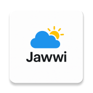
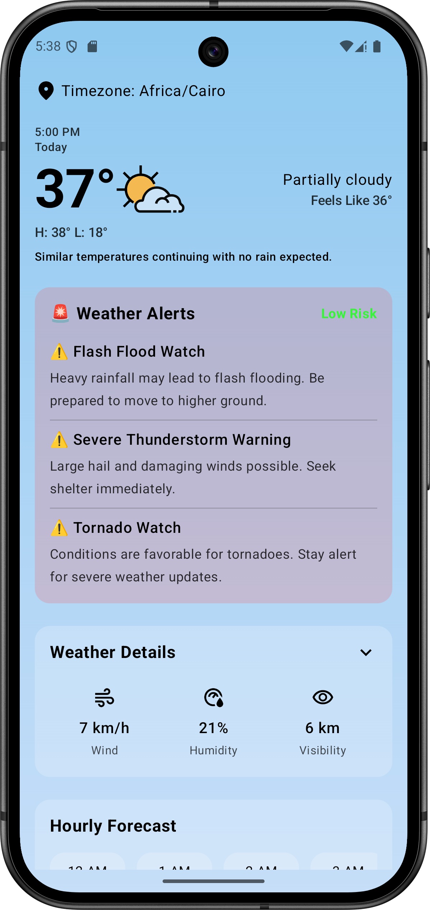

# Jawwi Weather App - Android Internship Task 2025

<div>
  
</div>

A weather tracking application built for the Android Internship Task 2025. This app demonstrates native Android development without relying on third-party libraries, showcasing pure Android capabilities and best practices.

## Screenshots
 hade weather alarms if theirs any  
<div style="display: flex; justify-content: space-between;">
    
   
</div>

## Demo Video

[//]: # ([Watch Demo Video]&#40;demo/jawwi_demo.mp4&#41;)
<div style="display: flex; justify-content: space-between;">
    <video src="demo/jawwi_demo.mp4" width="1000" alt="demo video"/>

</div>

## ✅ Task Requirements Fulfilled

### Core Requirements
1. **Location Services** ✓
   - Implements native Android location services
   - Accurately retrieves user's GPS coordinates (latitude, longitude)
   - Proper permission handling for location access

2. **Weather Data** ✓
   - Fetches current weather conditions
   - Retrieves 5-day weather forecast
   - Uses native HttpURLConnection for API calls (no Retrofit/Volley)

3. **Dual Screen Interface** ✓
   - Home screen displays current weather
   - Dedicated screen for 5-day forecast
   - Smooth navigation between screens

4. **Real-time Updates** ✓
   - Pull-to-refresh functionality
   - Updates weather data on demand
   - Smooth loading state handling

5. **Offline Support** ✓
   - Comprehensive error handling
   - Clear error messages for offline state
   - Graceful degradation when offline

### Technical Achievements

- **Zero Third-party Dependencies** ✓
  - No Retrofit
  - No Volley
  - No external networking libraries
  - Pure Android implementation
  - Note: Avoided Coroutines (though it's part of Kotlin standard library) to strictly follow requirements

### Bonus Features Implemented

1. **Data Persistence** ✓
   - Caches last retrieved weather data
   - Available offline after initial fetch
   - Uses native Android SharedPreferences

2. **Configuration Changes** ✓
   - Handles screen rotation seamlessly
   - Maintains state during configuration changes
   - No data loss on orientation change

## Features

- Real-time weather data using native HttpURLConnection
- Native GPS location tracking
- Offline-first architecture with caching
- Beautiful UI with weather-based themes
- Pull-to-refresh functionality
- Edge-to-edge design
- Configuration change support

## Tech Stack

- **Language**: Kotlin
- **UI Framework**: Jetpack Compose
- **Architecture**: MVVM
- **Networking**: Native HttpURLConnection
- **Storage**: SharedPreferences
- **Location**: Android Location Services API

## Project Structure

- `app/src/main/java/com/sergio/jawwi/`
  - `core/` - Core utilities and theme
  - `presentation/` - UI components and ViewModels
  - `data/` - Data persistence and network calls
  - `App.kt` - Main composable
  - `MainActivity.kt` - Entry point

## Building the Project

1. Clone the repository
```bash
git clone https://github.com/yourusername/jawwi.git
```

2. Add your API key in `local.properties`:
```properties
API_TOKEN=your_api_token_here
BASE_URL=your_base_url_here
```

3. Build and run using Android Studio

## Build Requirements

- Android Studio Hedgehog or later
- Minimum SDK: 26 (Android 8.0)
- Target SDK: 35
- Kotlin version: 2.0.21
